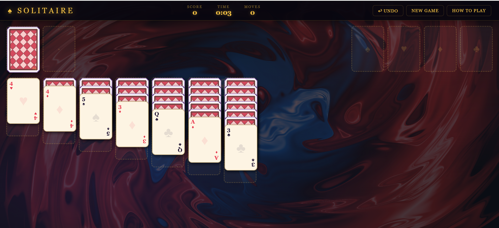
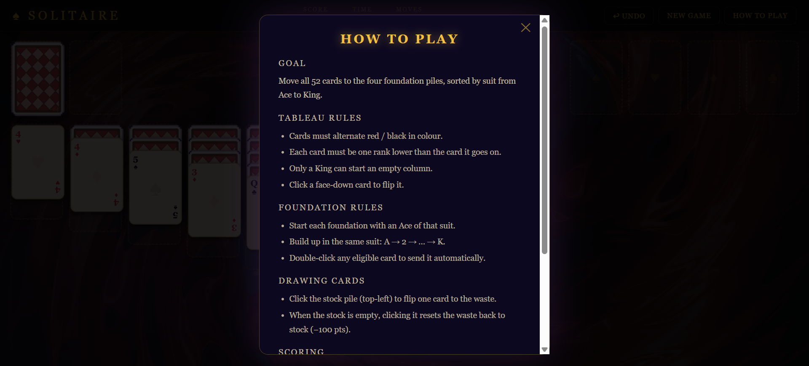
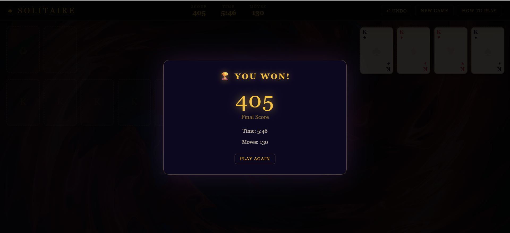

# ♠ Solitaire — Balatro Edition

A classic Klondike Solitaire game with a dark, stylish Balatro-inspired theme. Built with plain HTML, CSS, and JavaScript.

---

## Features

- **Drag and drop** — pick up single cards or whole stacks and drop them anywhere legal
- **Double-click** — instantly sends a card to the correct foundation pile
- **Undo** — step back up to 40 moves
- **Timer** — tracks how long your game takes
- **Scoring** — points for every good move, penalties for recycling the stock
- **How to Play** — built-in rules modal for quick reference
- **Play Again** — instantly reshuffles and deals a fresh game

---

## Screenshots

| Playing | How to Play | You Won |
|---------|-------------|---------|
|  |  |  |

---

## How to run

1. Download or clone the folder
2. Open `index.html` in any browser

---

## Scoring

| Move | Points |
|------|--------|
| Waste → Tableau | +5 |
| Any card → Foundation | +10 |
| Foundation → Tableau | −15 |
| Flip a face-down card | +5 |
| Recycle stock pile | −100 |